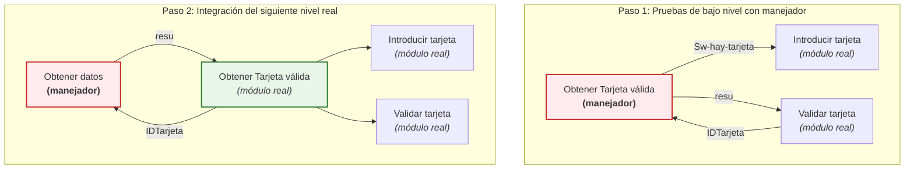

# Estrategias de Integración y Tipos de Defectos en el Software

Este documento recopila la información sobre las metodologías de prueba de integración (Ascendente, Descendente e Híbrida) y la clasificación de defectos comunes asociados a las interfaces, configuración e integridad del sistema.

## Ejemplo Práctico: Casos de Prueba de Registro e Inicio de Sesión

A continuación se detalla un ejemplo de diseño y ejecución de casos de prueba para el flujo de registro, persistencia de sesión y expiración:

| Caso | Acción | Resultado esperado | Resultado obtenido | ¿Pasó? |
| :--- | :--- | :--- | :--- | :--- |
| **C1** | Registrar usuario: usuario="ana", pass="123" | Mensaje "Registro exitoso". Redirige a pantalla de inicio. | Mensaje "Registro exitoso". | ❌ |
| **C2** | Iniciar sesión con usuario="ana", pass="123"<br>Cerrar la app sin cerrar sesión<br>Reabrir la app inmediatamente | Pantalla de inicio. El sistema mantiene la sesión activa. | Pantalla de inicio. El sistema mantuvo la sesión activa. | ✔️ |
| **C3** | Reabrir la app después de 30 minutos sin cerrar sesión. | Solicitar login nuevamente. | Solicita login. | ✔️ |

---

# Part I: Estrategias de Integración de Pruebas

Las pruebas de integración se encargan de verificar que los componentes individuales del software funcionen de manera correcta y armónica al interactuar entre sí. Existen tres enfoques principales:

## 1. Integración Ascendente (Bottom-Up)

- **Definición:** Se comienza probando los módulos de menor nivel de la arquitectura y se avanza hacia arriba hasta llegar al nivel más alto.
- **Proceso:** Se realizan pruebas de integración en cada nivel hasta que se integran todos los componentes del sistema.
- **Aplicación:** Esta estrategia se utiliza cuando se tiene un componente central y se van agregando más componentes alrededor.
- **Concepto Clave (Manejadores / Drivers):** Como los módulos superiores aún no están desarrollados o integrados, se utilizan programas de simulación de nivel superior llamados **manejadores** para coordinar y enviar datos a los módulos reales de bajo nivel.

### Flujo de Integración Ascendente:



---

## 2. Integración Descendente (Top-Down)

- **Definición:** Se comienza probando los módulos de mayor nivel de la arquitectura y se avanza hacia abajo hasta llegar al nivel más bajo.
- **Proceso:** Se realizan pruebas de integración en cada nivel hasta que se integran todos los componentes del sistema.
- **Aplicación:** Esta técnica se utiliza cuando el sistema ya está construido y se están agregando nuevos componentes o módulos.
- **Concepto Clave (Cabos / Stubs):** Como los módulos inferiores aún no están disponibles, se emplean módulos de simulación simples llamados **cabos** que simulan el comportamiento básico (valores de retorno fijos) de los módulos subordinados.

### Flujo de Integración Descendente:

```mermaid
graph TD
   subgraph (a) Primer paso descendente
       S1["SAC<br/><b>(Módulo real)</b>"]
       S1 --> C1["Obtener datos<br/><i>(cabo)</i>"]
       S1 --> C2["Calcula Adeudo<br/><i>(cabo)</i>"]
       S1 --> C3["Cobra<br/><i>(cabo)</i>"]
   end

   subgraph (b) Segundo paso descendente
       S2["SAC<br/><b>(Módulo real)</b>"]
       S2 --> C1_2["Obtener datos<br/><i>(cabo)</i>"]
       S2 --> R_Adeudo["Calcula Adeudo<br/><b>(Módulo real)</b>"]
       S2 --> C3_2["Cobra<br/><i>(cabo)</i>"]
   end

   style S1 fill:#e8f5e9,stroke:#2e7d32,stroke-width:2px;
   style S2 fill:#e8f5e9,stroke:#2e7d32,stroke-width:2px;
   style R_Adeudo fill:#e8f5e9,stroke:#2e7d32,stroke-width:2px;
   style C1 fill:#eceff1,stroke:#37474f,stroke-dasharray: 5 5;
   style C2 fill:#eceff1,stroke:#37474f,stroke-dasharray: 5 5;
   style C3 fill:#eceff1,stroke:#37474f,stroke-dasharray: 5 5;
```

---

## 3. Integración Híbrida (Sándwich)

- **Definición:** Se combina la integración ascendente y la integración descendente para probar simultáneamente algunos componentes del sistema, aprovechando las ventajas de ambos enfoques (por ejemplo, probando los niveles superiores de forma descendente y los inferiores de forma ascendente hacia un nivel intermedio común).

---

# Part II: Clasificación de Defectos de Integración

Durante el proceso de integración, los errores suelen ocurrir en los límites de interacción de los componentes. Se clasifican principalmente en problemas de Interfaz, Configuración e Integridad.

## 1. Defectos de Interfaz

| Tipo de defecto | Ejemplo o comentario | Causa posible |
| :--- | :--- | :--- |
| **Parámetro seleccionado de manera errónea** | Se tomó el parámetro "pre" como el que lleva el precio de un producto, pero en realidad era un valor de precedencia. | Confusión por mala documentación, nombres inadecuados o descuido. |
| **Parámetros (y valor de retorno) de tipo distinto al esperado** | Se envía un entero y se esperaba un número de punto flotante. | Lenguaje sin refuerzo de tipos (era más frecuente en el pasado). |
| **Carencia de aviso de excepción (en Unidad B)** | Un valor no previsto genera una división por cero, causando que el programa se termine de modo abrupto. | Deben considerarse posibles riesgos si los datos no cumplen condiciones preestablecidas y éstas deben informarse. |
| **Carencia de previsión sobre ocurrencia de excepciones** | Una excepción impide el fallo del programa, pero la Unidad A la ignora dejando valores indefinidos. | No se consideró que el software puede fallar de maneras no esperadas. |

## 2. Defectos de Configuración

| Tipo de defecto | Ejemplo o comentario | Causa posible |
| :--- | :--- | :--- |
| **Invocación de versión obsoleta** | Interfaz que fue válida alguna vez, pero que ha sido desplazada por otra. | Descuido al elegir los elementos a utilizar. |
| **Invocación de versión aún no instalada** | Interfaz que aún no está operando, aunque se haya anunciado. | Descuido al elegir los elementos a utilizar. |
| **Invocación de componente no disponible** | Se invoca una unidad que debiera existir, pero no se encuentra o está deshabilitada. | Bibliotecas no instaladas o dañadas, software de terceros en directorios equivocados o inaccesibles (red desconectada, firewall, falta de permisos). |
| **Problema con unidad de hardware** | Nunca recibe datos o estos no son los esperados. | El dispositivo requiere alimentación eléctrica adicional o alguna configuración que se omitió. |

## 3. Defectos de Integridad

| Tipo de defecto | Ejemplo o comentario | Causa posible |
| :--- | :--- | :--- |
| **Violación de integridad de datos** | Una unidad elimina registros de una base de datos que requiere otra unidad. | No se analizaron adecuadamente las responsabilidades de cada unidad y las necesidades de integridad. |
| **Estructura de datos incorrecta o inconsistente** | Una unidad altera archivos o registros en memoria compartida, que forman parte de la estructura de datos común. | No se analizaron adecuadamente las responsabilidades de cada unidad y las necesidades de integridad. |
